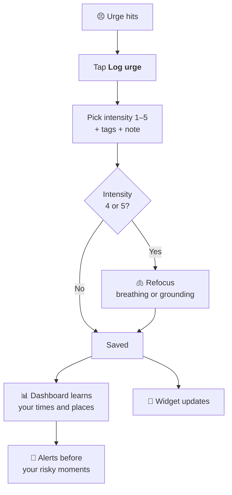
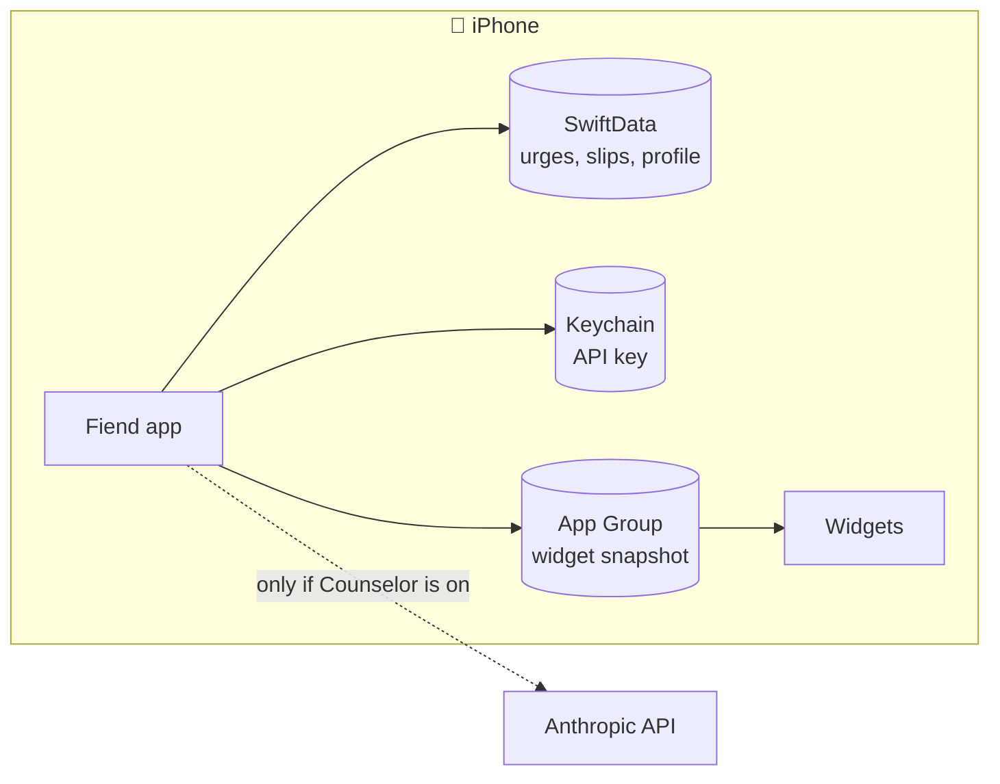
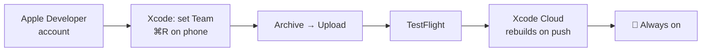
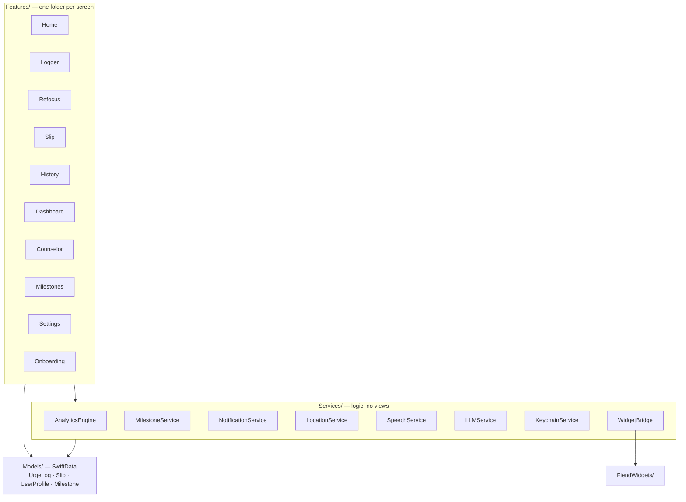

<div align="center">

# 🌱 Fiend

**A private urge & recovery tracker for iPhone.**
Log an urge in one tap, ride it out with a guided exercise, and see your patterns, all on your phone.


</div>

---

## ✨ What it does

| | |
|---|---|
| ⏱️ **Sober counter** | Days clean, a ring countdown to your next milestone, and your "why" on the home screen |
| 👆 **One-tap urge log** | Intensity 1–5, HALT / emotion tags, optional note; time and place saved automatically |
| 🫁 **Refocus** | Strong urge (4–5)? It opens 4-7-8 breathing or voice-guided 5-4-3-2-1 grounding |
| 📝 **Slip log** | A short reflection, with the option to reset your clean date |
| 📊 **Dashboard** | Time-of-day heatmap, weekday trends, urge wave, danger-zone map, money saved |
| 🏆 **Milestones** | 25 milestones from 12 hours to 5 years, with a celebration and optional alerts |
| 🔔 **Smart alerts** | A heads-up before your peak hour and near places where urges cluster |
| 💬 **Counselor** | Optional daily digest from Claude, using **your own** Anthropic API key |
| 🧩 **Widgets** | Days clean and next milestone on your home screen |

> Fiend is a self-help tool, not medical care. The app shows a medical disclaimer at onboarding and in Settings.

---

## 🔄 How an urge flows through the app



---

## 🔒 Your data stays on your phone



- No account, no server, no analytics.
- The **only** network call is the Counselor, and only when you turn it on and add your own key.
- **Settings → Erase all data** wipes everything; deleting the app does too.

---

## 📲 Get it on your iPhone



**Quick start** (needs a Mac with Xcode 16+ and a paid Apple Developer account):

1. `open Fiend.xcodeproj`
2. Target **Fiend → Signing & Capabilities** → set your Team (and a unique bundle ID if `com.fiendapp.fiend` is taken).
3. Pick your iPhone and press **⌘R**.

Full guide, including TestFlight and Xcode Cloud so it stays installed with no Mac: **[docs/install-on-iphone.md](docs/install-on-iphone.md)**.

> **Why a paid account?** The app shares data with its widget through an App Group, and free Apple IDs can't sign App Groups. To try it on a free Apple ID, clear `CODE_SIGN_ENTITLEMENTS` on the Fiend target first (widgets then won't get data).

<details>
<summary><b>🧩 Enabling widgets</b> (one-time Xcode step)</summary>

The widget target isn't in the project file by default, so the project opens cleanly on any signing setup.

1. In Xcode, **File → New → Target → Widget Extension**. Name it **FiendWidgets**, bundle id `com.yourname.fiend.FiendWidgets`. Uncheck "Include Configuration Intent."
2. Delete the auto-generated Swift file and the new Info.plist.
3. Right-click the `FiendWidgets` group → **Add Files** → pick the repo's `FiendWidgets/` folder, target membership **FiendWidgets**.
4. Set the target's **Info.plist** to `FiendWidgets/Info.plist` and **Code Signing Entitlements** to `FiendWidgets/FiendWidgets.entitlements`.
5. Add **App Groups** to both `Fiend` and `FiendWidgets` with the same id, `group.com.fiendapp.fiend` (or your own; then also update `WidgetBridge.swift` and `SobrietyWidget.swift`).
6. Build and run. Long-press the home screen → **+** → search "Fiend".

</details>

---

## 🏗️ How it's built



| Choice | Why |
|---|---|
| **SwiftUI + SwiftData** | Modern Apple stack, no third-party dependencies, CloudKit-ready if sync is ever wanted |
| **Feature folders** | Each screen owns its views and state; no cross-feature imports |
| **Pure services** | `AnalyticsEngine` and `MilestoneService` have no I/O, so they're easy to test |
| **`LLMService` protocol** | Claude is the default; another model is one new file |
| **Keychain for the key** | Never in UserDefaults, the database, or logs |
| **Widget snapshot** | `WidgetBridge` writes one small JSON file to the App Group; widgets read it |

<details>
<summary><b>📁 File layout</b></summary>

```
Fiend/
├── FiendApp.swift            @main, ModelContainer, milestone celebration gate
├── Models/                   UrgeLog, Slip, UserProfile, Milestone
├── Services/                 Location, Analytics, Milestone, Notification,
│                             Keychain, LLM, Speech, WidgetBridge
├── DesignSystem/Theme.swift
├── Features/                 Onboarding, Home, Logger, Refocus, Slip, History,
│                             Counselor, Milestones, Dashboard, Settings
├── Assets.xcassets
├── Info.plist                location, mic, speech permission strings
└── Fiend.entitlements        App Group
FiendWidgets/                 widget extension (see "Enabling widgets")
docs/install-on-iphone.md     install + TestFlight guide
PRIVACY_POLICY.md
```

</details>

<details>
<summary><b>🗺️ Feature → code map</b></summary>

| Feature | Where |
| --- | --- |
| One-tap urge logger | `HomeView` → `UrgeLoggerView` |
| HALT / emotion tags | `EmotionalTag` enum + chip grid |
| Timestamp + location | `UrgeLog.init` + `LocationService.oneShotLocation()` |
| Refocus (intensity 4/5) | `RefocusView`: 4-7-8 pacer + voice-gated 5-4-3-2-1 grounding |
| Sober counter | `SoberCountdownView` + `SoberDaysBadge` |
| Slip log + clean days of 30 | `SlipLoggerView` + `AnalyticsEngine.cleanDaysInLast30(cleanStart:)` |
| Time-of-day heatmap | `HourHeatmapView` |
| Weekday trends | `WeekdayChartView` |
| Danger-zone map | `DangerZoneMapView` + `AnalyticsEngine.dangerZones` |
| Refocus success rate | `SuccessRateView` |
| Urge wave | `UrgeWaveView` |
| Correlation card | `CorrelationInsightCard` + `AnalyticsEngine.topCorrelation` |
| Sober dividend | `SoberDividendView` |
| Delete urges + slips | `HistoryView` swipe + `HomeView` context menu |
| Peak-time + place alerts | `NotificationService` (daily trigger + region monitoring) |
| Home location | Onboarding toggle + Settings button |
| Counselor (BYOK) | `CounselorView` + `AnthropicCounselor` + `KeychainService` |
| Milestones | `MilestoneService` + `MilestoneCelebrationView` + `MilestoneTrackerCard` |
| Widgets | `FiendWidgets/` |
| Why card | `WhyCard` + `WhyEditor` |
| Medical disclaimer | Onboarding gate + Settings sheet |
| Privacy policy | Settings sheet + `PRIVACY_POLICY.md` |

</details>

---

## 🚀 Before a wider release

| Item | Status |
| --- | --- |
| App icon | ⬜ Add a 1024×1024 PNG to `Assets.xcassets/AppIcon.appiconset` (TestFlight upload needs it) |
| Privacy labels | ⬜ "Data Not Collected"; declare the Counselor request if BYOK is on |
| Accessibility pass | ⬜ Run Accessibility Inspector (tap targets are already ≥ 44 pt) |
| Medical disclaimer | ✅ Onboarding + Settings |
| Permission strings | ✅ Location, microphone, speech in `Info.plist` |
| Notifications | ✅ Asked only when you turn an alert on |
| iCloud sync | ⬜ Optional: set `cloudKitDatabase:` on the ModelConfiguration + entitlement |
| License | ⬜ Personal use for now; add a LICENSE before sharing |
